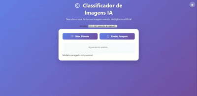

# 🎯 Classificador de Imagens com IA


> Um projeto interativo desenvolvido em **JavaScript + TensorFlow.js** que permite classificar imagens e objetos em tempo real utilizando **modelos de inteligência artificial** diretamente no navegador.



---

## 🚀 Funcionalidades

✅ Upload de imagens locais  
✅ Uso da câmera em tempo real (captura, troca e parada)  
✅ Classificação com o modelo **MobileNet**  
✅ Alternância para o modelo **COCO-SSD** (detecção de objetos)  
✅ Histórico de análises salvo no navegador  
✅ Estatísticas (total e categorias mais frequentes)  
✅ Tema escuro automático 🌙 / claro ☀️  
✅ Toasts com mensagens de status e erros  
✅ Funciona **offline** (PWA)  
✅ Pode ser instalado como aplicativo no celular 💾  

---

## 🧠 Tecnologias utilizadas

| Tecnologia | Descrição |
|-------------|------------|
| **HTML5 / CSS3 / JavaScript** | Estrutura, estilo e lógica do app |
| **TensorFlow.js** | Execução de modelos de IA no navegador |
| **MobileNet** | Classificação de imagens |
| **COCO-SSD** | Detecção de múltiplos objetos |
| **Service Worker + Manifest PWA** | Suporte offline e instalação |
| **LocalStorage** | Armazenamento do histórico local |

---

## 🏗️ Estrutura de pastas

```bash
ClassificadorImagensIA/
│
├── index.html
├── manifest.json
├── service-worker.js
│
└── Assets/    
    ├── css
    ├── img
    └── js
        ├── style.css
        └── script.js
```

---

## ⚙️ Como executar o projeto

### 🧩 Pré-requisitos

Navegador moderno (Chrome, Edge ou Firefox)

Servidor local (ex.: Live Server do VSCode)

---

### ▶️ Passos

#### 1. Clone o repositório
```bash
git clone https://github.com/evertonldesouza/ClassificadorImagensIA.git
cd ClassificadorImagensIA
```
#### 2. Abra o projeto com o Live Server

* Clique com o botão direito no index.html → “Open with Live Server”

* Acesse: http://localhost:5500 (ou a porta exibida no terminal)

#### 3. Permita o uso da câmera, se desejar usar a função de captura.

#### 4. Use offline ou instale como app!

* Depois de carregar uma vez, ele funcionará mesmo sem internet.

* No Chrome → Clique em “Instalar Classificador de Imagens IA” na barra de endereço.

---

## 🧩 Modelos de IA suportados

| Modelo | Tipo | Uso |
| :--- | :--- | :--- |
| MobileNet | Classificador de imagens | Rápido e leve |
| COCO-SSD | Detector de objetos | Detecta múltiplos itens na imagem |

Você pode alternar entre os modelos no seletor localizado na interface do app.

---

## 🧰 PWA – Aplicativo Web Progressivo

### O projeto inclui:
* manifest.json — define nome, ícones e cores do app
* service-worker.js — faz cache dos arquivos para uso offline

### 🔌 Como testar o modo offline

#### 1. Execute o projeto via servidor local (Live Server ou npx http-server)
#### 2. Abra DevTools → Application → Service Workers
#### 3. Verifique se aparece “✅ Activated and running”
#### 4. Desconecte a internet e recarregue → o app continua funcionando!

---

## 🧾 Histórico e estatísticas

O app armazena localmente suas análises:
* Total de classificações realizadas
* Categoria mais frequente
* Data e hora da última análise
Você pode limpar o histórico a qualquer momento com o botão “Limpar Histórico”.

---

## 💡 Ideias futuras
* Implementar redimensionamento automático das imagens
* Adicionar tradução automática dos rótulos
* Mostrar imagens ilustrativas (via API do Unsplash)
* Criar modo educativo “Como a IA pensa”
* Publicar versão com modelo customizado via Teachable Machine

---

## 👨‍💻 Autor

Everton Souza  
Desenvolvedor .NET e entusiasta de IA aplicada ao front-end.  
📍 Brasil  
💼 [LinkedIn](https://www.linkedin.com/in/evertonldesouza/) • 🌐 [GitHub](https://github.com/evertonldesouza)

---

## 🧠 Créditos

* [TensorFlow.js](https://www.tensorflow.org/js)
* [MobileNet](https://github.com/tensorflow/tfjs-models/tree/master/mobilenet)
* [COCO-SSD](https://github.com/tensorflow/tfjs-models/tree/master/coco-ssd)
* Interface inspirada em tendências modernas de UI (Glassmorphism + Gradientes)

---

## 🖼️ Licença

Este projeto é open-source sob a licença MIT.
Sinta-se à vontade para usar, estudar e modificar! 